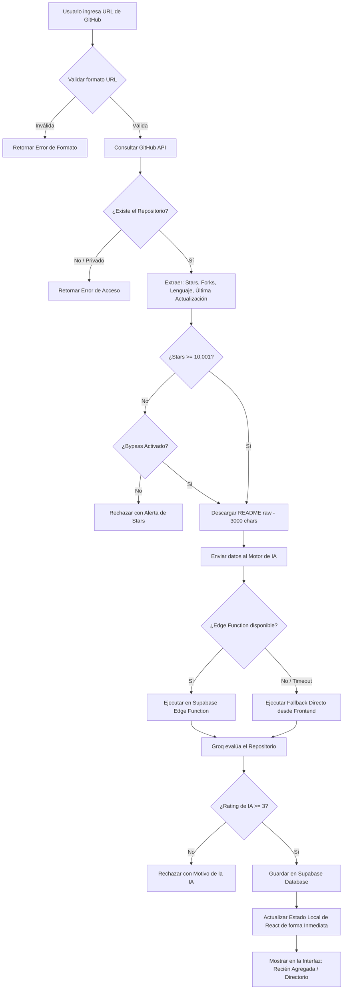

# 🎯 SkillAI - Ficha Técnica y Reporte del Hackathon
> **Directorio Colaborativo de Habilidades (Skills) para Agentes de IA**  
> *Desarrollado para la Comunidad Hispana de Desarrolladores — Evaluado automáticamente por Inteligencia Artificial*

---

## 📋 Resumen del Proyecto

**SkillAI** es una plataforma moderna diseñada para catalogar, buscar y copiar comandos de instalación de habilidades (Skills) listas para ser integradas en Agentes de Inteligencia Artificial. Resuelve la barrera idiomática traduciendo y explicando herramientas técnicas complejas al español de manera didáctica, estructurada y automatizada gracias a un motor de evaluación con IA.

---

## 🏗️ Stack Tecnológico Implementado

| Capa | Tecnología | Rol / Propósito |
| :--- | :--- | :--- |
| **Frontend** | React (Vite) + Tailwind CSS | Interfaz de usuario responsiva, rápida y con estética premium. |
| **Backend & Base de Datos** | Supabase (PostgreSQL) | Almacenamiento persistente, políticas de seguridad RLS y APIs autogeneradas. |
| **Edge Computing** | Supabase Edge Functions | Ejecución segura de código backend aislado en la nube (Deno). |
| **Motor de IA** | Groq API (Llama 3.3 70B) | Análisis y curaduría automatizada de los repositorios de código. |
| **Servicio de Datos** | GitHub API | Extracción de metadatos reales y documentación técnica (README). |

---

## 🤖 El Corazón de la Plataforma: Flujo de Evaluación por IA

El mayor diferenciador de SkillAI es su **mecanismo de curaduría automática**. En lugar de depender de registros manuales susceptibles a spam o descripciones deficientes, la IA actúa como el filtro y redactor principal.

### 1. Los Criterios de Aprobación
El sistema implementa una lógica de aprobación basada en dos niveles:
*   **Criterio Objetivo (GitHub Stars):** El repositorio debe contar con un mínimo de **10,001 estrellas** en GitHub para garantizar su madurez y adopción comunitaria. (Existe un mecanismo de *bypass* para herramientas valiosas de nicho).
*   **Criterio Subjetivo (Calificación de IA):** La IA evalúa la documentación del repositorio y le asigna una puntuación de 1 a 5 estrellas. Debe obtener **mínimo 3 estrellas** para ser aprobada.

---

### 2. El Flujo de Ejecución Técnico (Paso a Paso)



#### Detalles de la Transición de Datos
1.  **Parseo y Validación:** El sistema extrae el `owner` y el `repo` mediante expresiones regulares en el frontend.
2.  **Extracción de GitHub:** Se realiza una llamada HTTP al endpoint de GitHub API (`/repos/{owner}/{repo}`) y al endpoint del README en formato plano (`/repos/{owner}/{repo}/readme`).
3.  **Generación del Prompt de Sistema:** La IA recibe un prompt estructurado de alta precisión que le exige responder **únicamente con un objeto JSON válido**.
4.  **Estructura JSON Esperada de la IA:**
    ```json
    {
      "name": "Nombre reconocible",
      "description": "Explicación profunda en español (150-250 palabras) sobre qué es y qué problema resuelve.",
      "use_case": "Escenario específico de uso (50-100 palabras).",
      "example_usage": "Ejemplo práctico de código listo para copiar y usar.",
      "category": "Frontend | Backend | DevOps | Data Science | Testing | Database | Security | AI/ML | API & Integration | Mobile | CLI Tools",
      "install_command": "npm install X / pip install X / etc.",
      "license": "MIT / Apache-2.0 / GPL-3.0 / etc. o 'No especificada'",
      "maintenance_status": "Activo | Mantenimiento | Inactivo",
      "risk_level": "Bajo | Medio | Alto",
      "agent_prompt": "Instrucción de Sistema estructurada y lista para copiar al Agente de IA.",
      "agent_reasoning_trace": [
        "Paso 1: Validación del repositorio...",
        "Paso 2: Análisis del README...",
        "Paso 3: Clasificación automática...",
        "Paso 4: Dictamen final..."
      ],
      "rating": 5,
      "approved": true,
      "reason": ""
    }
    ```

---

## 🌟 Bondades y Mejoras Implementadas (Últimos Ajustes)

Durante el desarrollo final del proyecto, se introdujeron mejoras críticas de resiliencia, usabilidad y rendimiento que elevan el MVP a un estándar de producción:

### 🛡️ 1. Auditoría de Salud y Seguridad del Repositorio (IA-Driven)
El motor de evaluación analiza la salud del proyecto:
*   **Licencia:** Identificación e inyección de la licencia del software (ej. MIT, Apache 2.0).
*   **Mantenimiento:** Análisis del estado del repositorio (Activo / Mantenimiento / Inactivo) basado en la fecha de su última actualización en GitHub.
*   **Riesgo:** Evaluación del riesgo y complejidad de la integración (Bajo / Medio / Alto) para prevenir problemas de dependencias en cascada.
*   **Visualización en UI:** Tarjetas resumidas (badges) a nivel de grilla y un cuadro tripartito coloreado en el modal de detalles.

### 🤖 2. Instrucción de Sistema y Prompt para Agentes IA
*   Cada habilidad incluye un bloque interactivo titulado **"Prompt de Integración para tu Agente IA"**.
*   El usuario puede copiar este texto con un clic para instruir a cualquier LLM (Claude, ChatGPT, etc.) sobre cómo, cuándo y bajo qué patrones arquitectónicos invocar y utilizar la habilidad respectiva.

### 🧠 3. Traza de Razonamiento y Transparencia (Explicabilidad)
*   Enfocado en la explicabilidad, el modal ahora incluye el desplegable interactivo **"Ver dictamen del Agente"**.
*   Muestra en 4 viñetas numeradas el proceso exacto que la IA siguió para validar el número de estrellas, analizar la documentación, realizar la categorización y dar su veredicto final.

### 🔄 4. Botón de Actualización y Re-evaluación en Tiempo Real
*   El modal de detalles ahora incorpora la acción **"Actualizar con IA"**.
*   Al pulsarlo, el sistema realiza llamadas asíncronas para descargar las métricas más recientes de GitHub, procesa de nuevo el README con el modelo Llama de Groq y actualiza la tarjeta tanto en la base de datos de Supabase como en el estado de React en tiempo real, reflejando el cambio de inmediato en la interfaz.

### ⚡ 5. Arquitectura de Evaluación Híbrida (Dual Path)
Para evitar fallas catastróficas si el backend está en mantenimiento o si la función del servidor excede límites de tiempo:
*   **Camino Principal:** El frontend intenta llamar a la **Edge Function** remota de Supabase (`supabase.functions.invoke('evaluate-skill')`).
*   **Camino Fallback:** Si la Edge Function tarda más de **8 segundos** o retorna un error de conexión, el frontend captura la excepción y ejecuta la evaluación localmente (`evaluateLocally`). Este flujo alternativo conecta de manera directa con las APIs de GitHub y Groq usando la clave `VITE_GROQ_API_KEY` inyectada en el navegador.

### 🛡️ 6. Tolerancia a Fallos en Base de Datos (Mecanismo Fallback de Datos)
Si la base de datos de Supabase sufre una caída de red o no está inicializada:
*   La aplicación captura el error de forma silenciosa y carga un catálogo interno de respaldo (**DEMO_SKILLS**) que incluye herramientas populares (React, NestJS, PyTorch, Tailwind, Supabase, FastAPI) precargadas con sus correspondientes auditorías, prompts de agente y trazas de razonamiento.
*   Esto garantiza que la interfaz **siempre** sea funcional y visualmente atractiva para el evaluador o usuario.

### 🔄 7. Actualización de Interfaz Reactiva y Optimista
*   Cuando la IA aprueba una nueva habilidad, esta no requiere que el usuario recargue el navegador para visualizarla. El sistema actualiza el estado local de React de manera optimista agregando la nueva tarjeta directamente al grid del directorio general y posicionándola en el carrusel de **"Recién Agregadas"**.

### 🗑️ 8. Sistema de Eliminación con Confirmación de Doble Factor
*   Se diseñó una ventana de confirmación estética (`ConfirmModal.jsx`) para prevenir borrados accidentales de habilidades.
*   El backend distingue si la habilidad a eliminar está guardada en la base de datos persistente (realiza un borrado real mediante llamada API de Supabase) o si es parte de las habilidades demo en memoria (realiza un filtrado del estado local).

### 🗑️ 9. Bypass de Límite de Estrellas (BypassMinStars)
*   Se implementó una casilla inteligente de verificación en el formulario de envío. Si un usuario propone una herramienta increíble pero que no posee las 10,001 estrellas de GitHub requeridas, el sistema detecta que no cumple el mínimo y muestra un aviso interactivo que le permite forzar la evaluación si considera que es de altísimo valor para la comunidad.

---

## 🎨 Diseño Visual y UX Premium (Apple-Style)

Se aplicaron principios rigurosos de diseño limpio, moderno e interactivo:
*   **Glassmorphism:** Empleo de desenfoques de fondo (`backdrop-filter`) y transparencias en la barra de navegación superior.
*   **Microinteracciones:** Transiciones y animaciones suaves al hacer hover sobre las tarjetas (`transform: translateY(-4px)` y sombras dinámicas).
*   **Ambiente Premium:** Inclusión de efectos visuales de fondo como gradientes de malla suaves (`bg-mesh-glow`) y una red geométrica que imita redes neuronales o flujos de agentes (`bg-network-nodes`).
*   **Sistema de Avisos (Toast):** Notificaciones flotantes no intrusivas que confirman acciones como copiado de comandos o eliminaciones exitosas.

---

## 📁 Esquema de Base de Datos (PostgreSQL en Supabase)

La tabla de almacenamiento en Supabase está optimizada y cuenta con las siguientes propiedades actualizadas:

```sql
CREATE TABLE skills (
  id UUID DEFAULT gen_random_uuid() PRIMARY KEY,
  name TEXT NOT NULL,
  description TEXT NOT NULL,
  use_case TEXT,
  example_usage TEXT,
  category TEXT NOT NULL,
  install_command TEXT,
  language TEXT,
  stars INTEGER NOT NULL,
  rating INTEGER CHECK (rating >= 1 AND rating <= 5),
  original_url TEXT NOT NULL UNIQUE,
  repo_owner TEXT,
  repo_name TEXT,
  last_updated TEXT,
  approved BOOLEAN DEFAULT false,
  reason TEXT,
  license TEXT DEFAULT 'No especificada',
  maintenance_status TEXT DEFAULT 'Activo',
  risk_level TEXT DEFAULT 'Medio',
  agent_prompt TEXT,
  agent_reasoning_trace TEXT[],
  pros TEXT[],
  cons TEXT[],
  agent_recommendation TEXT,
  is_exception BOOLEAN DEFAULT false,
  created_at TIMESTAMPTZ DEFAULT now()
);

-- Políticas de seguridad (RLS)
ALTER TABLE skills ENABLE ROW LEVEL SECURITY;

CREATE POLICY "Skills aprobadas son públicas" ON skills 
  FOR SELECT USING (approved = true);

CREATE POLICY "Permitir inserciones desde Edge Function" ON skills 
  FOR INSERT WITH CHECK (true);

CREATE POLICY "Permitir actualizaciones desde Edge Function" ON skills 
  FOR UPDATE USING (true) WITH CHECK (true);
```

---

## 🔌 Activación, Conectividad y Carga de Datos Reales (Supabase Activo)

La base de datos remota de Supabase ha sido completamente conectada, configurada y activada:
1. **Esquema de Base de Datos y Políticas RLS:** Creadas con éxito en el panel web mediante SQL Editor.
2. **Conexión Directa:** Vinculada de forma segura usando la clave `SUPABASE_SERVICE_ROLE_KEY` real y decodificada en el archivo `.env`.
3. **Carga de Datos Reales (Seeding):** Las 6 habilidades de demostración (React, NestJS, PyTorch, Tailwind CSS, Supabase y FastAPI) han sido insertadas como registros reales y permanentes en la base de datos de producción.
4. **Verificación de Producción:** El frontend en Vercel y local consultan la base de datos remota en tiempo real y renderizan la grilla desde Supabase sin depender de fallbacks locales.

---

## 🏁 Conclusión y Preparación para el Pitch
SkillAI demuestra cómo la Inteligencia Artificial puede ser un facilitador de integración de software y una herramienta de democratización del conocimiento técnico. La robustez técnica agregada (el flujo dual de evaluación, la resiliencia contra fallas de base de datos y la interactividad avanzada) garantizan una presentación sólida y a prueba de errores durante la demostración en vivo de la hackathon.
